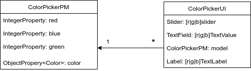

# [DEPA]ColorPicker
Martin Hediger

## Description
The app follows the *Presentation Model* pattern and
is based on the color picker app that was introduced in OOP2 class.

A *Color* is unambiguously defined by a tuple of three integers
ranging from 0 to 255.

The app consists of a model that represents the state of the
currently set color (*ColorMixerPM*) and a view (*ColorMixerUI*)
which handles the user input.
The entry point to the app is in the *ColorMixerApp* class.

## Implementation
The view his composed of an instance of the model and control instances,
i.e. sliders, input fields and text labels.
Sliders and input fields can accept user input, text labels can only
display a value.

These integers of the tuple are implemented as JavaFX *IntegerProperty*.
The slider and input field properties are bound bidirectionally to the
corresponding property on the model to keep them in sync with the model.

## To do
How should the radio buttons behave when a value that is not a strict
basic color is set using the sliders or input fields? Out of a group
at least one radio button has to be selected, but this is consistently
possible if values other than 255 can be set.

